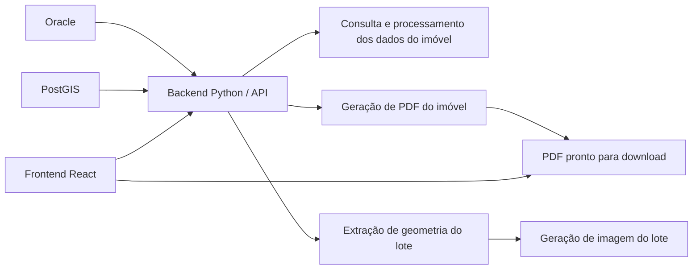

# Projeto Python + QGIS + Web


## 1. Objetivo do Projeto

Este projeto tem como objetivo automatizar a extração e integração de informações geoespaciais de diferentes bancos de dados(Oracle, PostGIS), arquivos GPKG e TIFF, que antes só eram acessíveis via **QGIS**, um software livre de Sistema de Informação Geográfica (GIS) usado para visualizar, editar e analisar mapas e camadas geográficas, exigindo consultas manuais.

No **Instituto de Pesquisa e Planejamento** da cidade, arquitetos e engenheiros recebem solicitações de outros órgãos públicos que desejam informações cadastrais e espaciais de imóveis ou lotes para diversos fins administrativos. Anteriormente, o processo de resposta envolvia localizar manualmente o imóvel no QGIS, selecionar o lote, gerar cortes por print da imagem de satélite da cidade, copiar informações cadastrais e colar manualmente em relatórios em PDF, o que era massante e propenso a erros, especialmente sob alta demanda.

A solução desenvolvida elimina todo o trabalho manual. Os dados são extraídos diretamente das fontes, as geometrias são processadas e alinhadas automaticamente, e o relatório em PDF é gerado completo, com o lote principal destacado, lotes vizinhos contornados e a localização na imagem de satélite da cidade, pronto para uso oficial.

Fontes de dados utilizadas:

- **Oracle** → informações cadastrais do imóvel (GEO_IMOBILIARIO)

- **PostGIS** → geometria do lote principal

- **GPKG** → geometrias de referência de todos os lotes para alinhamento com outras camadas

- **TIFF** → imagens de satélite da cidade

O fluxo do projeto inclui:

- Consulta e integração de dados

- Dados cadastrais do imóvel obtidos do Oracle.

- Geometrias do lote principal obtidas do PostGIS

- Ajuste de lados dos polígonos e aplicação de buffer ao redor do lote principal com Shapely, destacando a área de interesse.

- Seleção de lotes vizinhos dentro do buffer para exibição no PDF.

- Geometrias dos lotes vizinhos obtidas do arquivo arquivo GPKG

- Geometrias dos lotes são reprojetadas para o mesmo CRS (Coordinate Reference System) do raster de satélite usando Geopandas, garantindo alinhamento correto e compatibilidade espacial antes da plotagem e geração do PDF.

- Cálculo de similaridade geométrica entre a geometria de referência e lotes candidatos(dentro do buffer) do GPKG usando Geopandas, Shapely e Pandas, com métricas de cobertura, distância entre centroides e diferença de área.

- Processamento de geometrias

- Visualização e recorte de imagens

- Leitura de imagens TIFF de satélite via Rasterio.

- Recorte do raster de acordo com o lote principal + buffer.

- Plotagem das geometrias sobre o raster com Matplotlib, destacando o lote principal em vermelho, vizinhos em amarelo e números dos lotes.

- Pré-processamento de imagens com Pillow (corte e bordas).

- Geração de PDF

- Criação do documento com ReportLab (SimpleDocTemplate, Paragraph, Table, Image, Spacer) e layout conforme modelo oficial da Prefeitura.

- Inserção de cabeçalho institucional, dados do imóvel, imagem do lote com buffer e footer personalizado.

- O PDF é gerado em memória (BytesIO), pronto para ser salvo ou distribuído via web.


## 2. Tecnologias e Ferramentas

**Linguagens:** 
- Python, JavaScript

**Bibliotecas Python:**
- **`oracledb` →** conexão e consulta de dados cadastrais no Oracle
- **`psycopg2` →** conexão e manipulação de dados no PostGIS
- **`PyQGIS` →** manipulação e análise de dados geoespaciais dentro do QGIS (usado para validação e testes)
- **`reportlab` →** geração de PDFs com layout, tabelas, textos e imagens
- **`FastAPI` →** framework web assíncrono usado para criar o backend que fornece os dados geoespaciais e gera PDFs automaticamente
- **`Geopandas` / `Shapely` / `Pandas` →** manipulação, análise e cálculo de similaridade de geometrias e dados espaciais
- **`Rasterio` →** leitura e recorte de imagens raster georreferenciadas (TIFF)
- **`Matplotlib` →** renderização de mapas e sobreposição de vetores sobre imagens raster
- **`Pillow (PIL)` →**pré-processamento de imagens antes de incluir no PDF

**Bibliotecas JavaScript:**
**`React` →** desenvolvimento do frontend da aplicação web
**`axios` →** requisições HTTP para comunicação com o backend

**Softwares GIS:**
- **QGIS →** visualização, análise e validação de dados geoespaciais

**Sistema Operacional:**
- [Windows/Linux/Outro]


## 3. Estrutura do Projeto

```text
meu_projeto/
├──backend/
├── src/
│   ├── main.py                  # Ponto de entrada da API FastAPI
│   ├── utils/
│   │   └── pdfGenerator.py      # Função para geração de PDFs
│   ├── services/
│   │   └── api.py   
│   ├── repositories/
│   │   ├── oracleRepository.py  # Funções para acessar dados de imóveis no Oracle
│   │   └── postGresRepository.py# Funções para acessar dados de imóveis no PostgreSQL
│   ├── database/
│   │   ├── oracleDb.py  # Função para executar queries no Oracle
│   │   └── postGresDb.py# Função para executar queries no PostgreSQL
│   ├── testes/
│   │   ├── oracleConnectionTest.py # Teste de conexão Oracle
│   │   └── ...                      # Outros testes
│   └── config/
│       ├── oracleConnection.py      
│       ├── postGresConnection.py  
│       └── settings.py  
│   └── controllers/
│       └── pdfController.py      # Roteador para geração de PDF via API
├── frontend/             # Aplicação React
│   ├── src/              # Código fonte React
│   └── package.json      # Dependências e scripts React
│   └── components
│   │    ├── Card.jsx
│   │    ├── Checkbox.jsx
│   │    ├── downloadButtom.css
│   │    ├── downloadButtom.jsx
│   │    ├── inscricaoInput.jsx
│   │    ├── RelatorioForm.css
│   │    ├── RelatorioForm.jsx
│   ├── data/ 
│   └─ pdfImages/
│   │   ├─ IPPULOGO.png      # Logo oficial usada no cabeçalho
│   │   └─ IMGTESTE.png      # Imagem de teste (ex: mapa/lote)    
│   ├── services/ 
│   │   └─ api.jsx
│   ├── app.css
│   ├── app.jsx
│   ├── index.css
│   ├── index.jsx
├── output/               # PDFs e imagens geradas
└── README.md             # Este arquivo
```

## 4. Fluxo do Projeto

> **Descrição:** Os dados dos imóveis são consultados a partir do número de inscrição informado pelo usuário.
O backend Python processa consultas no Oracle para extrair informações do imóvel e no PostGIS para extrair coordenadas do lote e processa e filtra os dados de acordo com a escolha do cliente no frontend e gera o relatório PDF. Futuramente será implementada a funcao de extrair a imagem do lote do arquivo ECW usando as coordenadas.
O frontend React consome a API para exibir dados e permitir download do PDF na intranet.


## 5. Funcionalidades

1. Consulta por número de inscrição

 - Entrada: número de inscrição do imóvel

 - Saída: dados correspondentes do imóvel


2. Extração de dados das camadas GEO_IMOBILIARIO e Lotes

 - Entrada: número de inscrição

 - Saída: atributos do imóvel e coordenadas do lote


3. Extração da imagem do lote

 - Entrada: coordenadas do lote

 - Saída: imagem recortada do arquivo ECW (mesmo sendo muito grande)


4. Geração de mapa do lote no QGIS

 - Entrada: dados geoespaciais extraídos

 - Saída: imagem do lote com geometria destacada


5. Criação de relatório em PDF

 - Entrada: dados do imóvel e imagem do lote

 - Saída: arquivo PDF pronto para consulta ou impressão


6. Frontend web (React)

 - Interface para o usuário inserir inscrição, visualizar dados, ver imagem do lote e baixar PDF


## 6. Instalação e Uso

**Pré-requisitos:**

Python >= 3.x

Node.js >= 16.x (para React)

QGIS >= 3.16.0-Hannover


**Bibliotecas Python:**

```bash
# Atualizar pip (opcional, mas recomendado)
python -m pip install --upgrade pip

# Instalar todas as bibliotecas do projeto
pip install -r requirements.txt

```
**Como executar:**
```bash

# Configurar conexões no config.py
# Executar o script principal
python src/generate_map.py
```
**Instalar dependências React:**
```bash
cd frontend
npm install
```

**Executar backend localmente:**
```bash
cd backend
# Para Flask
python src/app.py

# Ou para FastAPI
uvicorn src.main:app --reload
```

**Executar frontend localmente:**
```bash
cd frontend
npm start
```


## 9. Testes

Testar conexão com Oracle e PostGIS

Testar extração de dados com diferentes números de inscrição

Testar extração da imagem do lote do arquivo ECW

Testar geração de PDFs

Testar consumo da API pelo frontend React

## 10. Considerações Finais

Melhorias futuras: interface mais completa, mais filtros de análise


## 11. Referências

1. [Python Documentation](https://docs.python.org/3/)
2. [PyQGIS Documentation](https://docs.qgis.org/latest/en/docs/pyqgis_developer_cookbook/)
3. [Oracle Python Driver (python-oracledb / cx_Oracle)](https://python-oracledb.readthedocs.io/en/latest/)
4. [PostGIS Documentation](https://postgis.net/documentation/)
5. [ReportLab (PDF Generation)](https://www.reportlab.com/docs/)
6. [FastAPI Documentation](https://fastapi.tiangolo.com/)
7. [React Documentation](https://react.dev/)
8. [Rasterio Documentation](https://rasterio.readthedocs.io/en/latest/)
9. [GeoPandas Documentation](https://geopandas.org/en/stable/)
10. [Shapely Documentation](https://shapely.readthedocs.io/en/stable/)
11. [NumPy Documentation](https://numpy.org/doc/)
12. [Uvicorn Documentation](https://www.uvicorn.org/)
13. [Flaticon](https://www.flaticon.com/)
14. [Pandas Documentation](https://pandas.pydata.org/docs/)
15. [Pillow Documentation](https://pillow.readthedocs.io/)
16. [Matplotlib Documentation](https://matplotlib.org/stable/index.html)
17. [GeoPackage Format Documentation](https://www.geopackage.org/)


